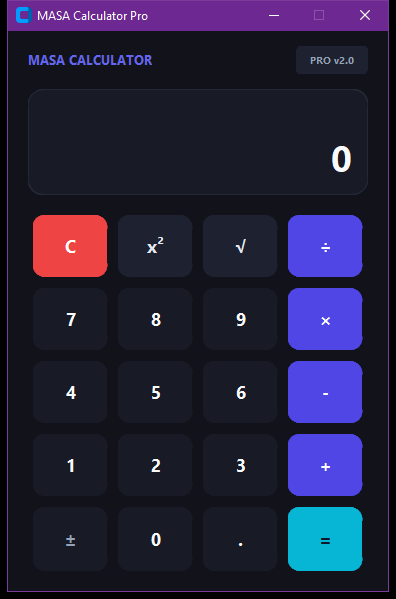

# MASA Calculator Pro

A high-precision desktop calculator application engineered with Python and CustomTkinter, featuring an asynchronous evaluation pipeline, dynamic UI updates, and hardware key-binding support.

## Technical Architecture

The application is architected around an object-oriented paradigm (`MasaCalculator`) encapsulating state management, input handling, and computational pipelines:

- **State Model**: Tracks expression buffers (`history_expr`, `current_expr`) and evaluation lifecycle triggers.
- **Evaluation Pipeline**: Implements defensive input parsing and algebraic evaluation with isolated zero-division interception and floating-point normalization.
- **Key Navigation**: Seamless mapping for standard numeric keypads, functional operators, and operational shortcuts (`Return`, `Escape`, `BackSpace`).
- **GUI Pipeline**: Dark-themed component tree constructed with modern DPI-scaled widgets from CustomTkinter.


## Preview


## Features

- Basic Arithmetic Operations (Addition, Subtraction, Multiplication, Division).
- Advanced Operations: Exponentiation (square) and square root routines.
- Sign inversion (negate) and live backspace editing.
- Responsive expression history preview.
- Keyboard bindings for fast desktop data entry.

## Prerequisites

- Python 3.10 or higher
- CustomTkinter library

Install required dependencies:

```bash
pip install customtkinter
```

## Execution

Launch the application via Python:

```bash
python "Simple Calculator App using Tkinter in Python/index.py"
```

## Project Structure

```
.
├── Simple Calculator App using Tkinter in Python/
│   └── index.py        # Core application source
├── LICENSE             # MIT License
└── README.md           # Engineering documentation
```

## License

This project is licensed under the terms of the MIT License. Refer to the `LICENSE` file for details.

---

### 🌐 Connect with Me

<p align="left">
  <a href="http://xrefs0.com/" target="_blank">
    
  </a>
  <a href="https://www.facebook.com/XREFS0" target="_blank">
    
  </a>
  <a href="https://t.me/MrMasaOfficial" target="_blank">
    
  </a>
  <a href="https://t.me/XREFS0_CHANNEL" target="_blank">
    
  </a>
  <a href="https://www.youtube.com/@XREFS0" target="_blank">
    
  </a>
</p>

